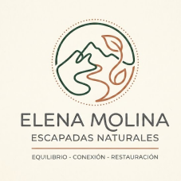

# ideapolis · Elena Molina

Espacio colaborativo y de publicación de proyectos de **Inteligencia Colectiva y Formación en la Empresa**.

> **Proyecto actual:** [**Elena Molina · Escapadas Naturales**](plantilla.md) — comunidad online para profesionales urbanos con estrés crónico. *Pausa, naturaleza y comunidad.* `#EscapadasNaturales`
>
> Autores: Darío Carrasco · Pablo Almeida · Daniella · Mayo 2026

En este espacio podrás acceder a los contenidos de la asignatura en formato wiki y a otros repositorios de apoyo para la realización de las prácticas.

La wiki https://github.com/mgea/ideapolis/wiki es una parte de este repositorio a la que se puede acceder desde el menú superior o bien desde los enlaces que se dejan a continuación.

## Contenidos del proyecto

- 📄 [**Plantilla rellena del proyecto**](plantilla.md) — documentación completa: misión, persona, DAFO, identidad visual, KPIs.
- 🏆 [Proyectos sala de la fama](hall_of_fame.md) — incluye este proyecto.
- 🎨 [Plantilla de proyecto base (template)](https://github.com/pablo0r/elena_molina_template) — fork de [ideapolis_template](https://github.com/mgea/ideapolis_template).
- 📚 [Apuntes contenidos (wiki)](https://github.com/mgea/ideapolis/wiki).

## Identidad visual

| Activo | Vista |
|---|---|
| Logo limpio | `img/04_logo_clean.png` |
| Logo aplicado | `img/02_logo_principal.png` |
| Paleta cromática | `img/05_paleta_colores.png` |
| Moodboard | `img/06_moodboard.png` |
| UX Writing | `img/03_ux_writing.png` |
| Estrategia de marca | `img/01_brand_strategy.png` |

**Paleta HEX:** `#A0522D` · `#F5EBDD` · `#4A6572` · `#7D7B77`

## Licencia

[CC BY-SA 4.0](LICENSE) — Creative Commons Attribution-ShareAlike 4.0 International.

